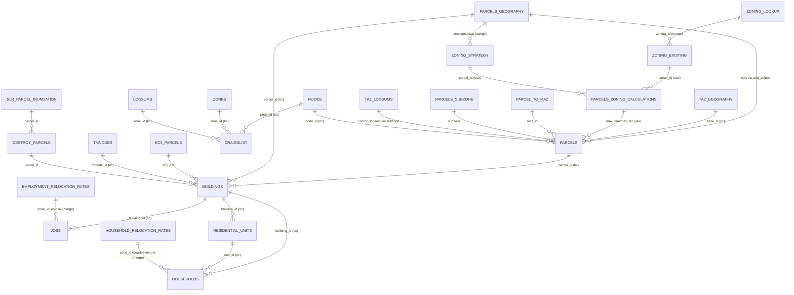

# BAUS Data Model

This document serves as a companion to the [Input](input.md) catalog. While Input documents source files on disk, this page defines how those files are loaded into Orca tables—including primary keys, provenance (resolving filenames via `run_setup` YAML keys), and relational dependencies.

## Graph Structure & Edge Types

Consistent with the [entity relationship diagram](#entity-relationship-diagram), this page represents the BAUS data model as a **graph**:

* **Nodes:** Orca tables (e.g., `parcels`, `buildings`, `zoning_existing`).
* **Edges:** Relational dependencies linking tables together. A table with no edges is an **island**—indicating it does not connect to the core `parcels`/`buildings` spine.

### How Join Mechanisms Work

Because relationships are defined using different mechanisms across the codebase, edge connections are categorized into three tags in the master index. **Comprehensive tracking requires looking beyond standard Orca broadcasts**: looking *only* at broadcasts misses critical `merge` and `use` edges, which would incorrectly make tables like `zoning_lookup` and `zoning_existing` appear as disconnected islands.

| Tag | Mechanism | Description | Location / How to Modify |
| --- | --- | --- | --- |
| **`bc`** | **Broadcast** | Declared `orca.broadcast(A, B, onto_on=fk)` lazy rule applied when tables are merged. | `datasources.py` (primarily lines 1029–1038) |
| **`merge`** | **Eager Merge** | Explicit `pd.merge(...)` inside a table builder function that materializes joined columns at creation. | The target table's builder function |
| **`use`** | **Use-Site Join** | Direct alignment/reindexing (via `misc.reindex`) inside `@orca.column` or model steps, bypasses global broadcasts. | The consuming function (e.g., `variables.py`) |

*Directionality Notation:* Arrows indicate data flow or target mapping (**Source → Target**). For example, `parcels → buildings (bc)` means `parcels` broadcasts onto `buildings`.

---

## Master Table Index

**File aliases:**

* `ds`=`datasources.py`
* `var`=`variables.py`
* `mdl`=`models.py`
* `ual`=`ual.py`
* `slr`=`slr.py`
* `eq`=`earthquake.py`
* `sub`=`subsidies.py`
* `pre`=`preprocessing.py`
* `sum/*`=`summaries/*`

| Table | Ref | Source / `run_setup` Key | PK / Index | Joins (Edges) |
| --- | --- | --- | --- | --- |
| `parcels` | ds:508 | HDF `store['parcels']` | `parcel_id` | ← `taz_geography` (`bc`), ← `parcels_geography` (`add_column`), → `buildings` (`bc`) |
| `buildings` | ds:785 | HDF `buildings_preproc` | `building_id` | ← `parcels`, `parcels_geography` (`bc`), → `households`, `jobs`, `residential_units` (`bc`) |
| `households` | ds:772 | HDF `households_preproc` | unnamed int64 (`household_id` float w/ NaN) | ← `buildings`, `residential_units` (`bc`) |
| `jobs` | ds:760 | HDF `jobs_preproc` (allocated) | unnamed int64 | ← `buildings` (`bc`), → `employment_relocation_rates` (`merge`) |
| `residential_units` | ds:790 | HDF `residential_units_preproc` | `unit_id` | ← `buildings` (`bc`), → `households` (`bc`) |
| `zones` | ds:909 | HDF `store['zones']` | `zone_id` | → `craigslist` (`bc`) |
| `zoning_lookup` | ds:360 | CSV / `zoning_lookup_file` | `id` | → `zoning_existing` (`merge`) |
| `zoning_existing` | ds:369 | CSV / `zoning_file` + `zoning_lookup` | `parcel_id` (via `geom_id`) | ← `zoning_lookup` (`merge`), → `parcels` via variables (`use`) |
| `zoning_strategy` | ds:479 | CSV / `zoning_mods_file` + `parcels_geography` | `parcel_id` | ← `parcels_geography` (`merge`), → `parcels_zoning_calculations` (`use`) |
| `parcels_geography` | ds:533 | CSV / `parcels_geography_file` | `parcel_id` (via `geom_id`) | → `parcels` (`add_column`), → `buildings` (`bc`), → `new_buildings` (`use`) |
| `parcels_zoning_calculations` | ds:523 | Virtual (`index=parcels`) | `parcel_id` | ← `zoning_existing`, `zoning_strategy` (`use`), → `parcels.max_dua/max_far` (`use`) |
| `development_projects` | ds:704 | CSV / `development_pipeline_file` | unnamed | Keyed to `parcels` on `geom_id` |
| `demolish_events` | ds:695 | CSV / `development_pipeline_file` | unnamed | Keyed to `parcels` on `geom_id` |
| `craigslist` | ual:225 | CSV `sfbay_craigslist.csv` + node IDs | unnamed | → `nodes`, `tmnodes`, `zones`, `logsums` (`bc`) |
| `taz_geography` | ds:892 | CSV `taz_geography.csv` | `zone` | → `parcels` (`bc`) |
| `superdistricts_geography` | ds:867 | CSV `superdistricts_geography.csv` | `number` | → `taz_geography` (`use`) |
| `maz` | ds:401 | CSV `maz_geography.csv` + crosswalk | `MAZ` | → `parcels.taz2` (`use`) |
| `parcel_to_maz` | ds:412 | CSV `2020_08_17_parcel_to_maz22.csv` | `PARCEL_ID` | → `parcels.maz_id` (`use`) |
| `parcels_subzone` | ds:576 | CSV `parcel_to_taz1454sub.csv` | `PARCEL_ID` | → `parcels.subzone` (`use`) |
| `taz_logsums` | ds:582 | CSV / `logsum_file` | `taz_subzone` | → `parcels.combo_logsum` (`use`) |
| `logsums` | ds:957 | CSV `logsums.csv` | `taz` | → `craigslist` (`bc`) |
| `vmt_fee_categories` | ds:861 | CSV `vmt_fee_zonecats.csv` | `taz` | → `parcels`, `buildings` (`use`) |
| `ec5_parcels` | ds:1023 | CSV `parcels_p10_x_ec5.csv` | `parcel_id` (float) | → `buildings.ec5_cat` (`use`) |
| `costar` | ds:342 | CSV `2015_08_29_costar.csv` | unnamed | Nearest-neighbor to `parcels` |
| `household_controls_unstacked` | ds:795 | CSV / `household_controls_file` | `year` | → `household_controls` (`reshape`) |
| `employment_controls_unstacked` | ds:820 | CSV / `employment_controls_file` | `year` | → `employment_controls` (`reshape`) |
| `slr_progression` | ds:916 | CSV / `slr_progression_file` | unnamed | → `destroy_parcels` (`use`) |
| `slr_parcel_inundation` | ds:929 | CSV / `slr_inundation_file` | `parcel_id` | → `destroy_parcels` → `buildings` (`use`) |
| `exog_sqft_per_job_adjusters` | ds:879 | CSV / `exog_sqft_per_job_adj_file` | `number` | → `buildings.sqft_per_job` (`use`) |
| `sqft_per_job_adjusters` | ds:872 | CSV / `sqft_per_job_adj_file` | `number` | → `buildings.sqft_per_job` (`use`) |
| `telecommute_sqft_per_job_adjusters` | ds:886 | CSV / `sqft_per_job_telecommute_file` | `number` | → `buildings.sqft_per_job` (`use`) |
| `employment_relocation_rates` | ds:962 | CSV `employment_relocation_rates.csv` | `zone_id` | → `jobs` (`merge`) |
| `employment_relocation_rates_adjusters` | ds:969 | CSV / `emp_reloc_rates_adj_file` | `zone_id` | Overwrites rates (`merge`) |
| `household_relocation_rates` | ds:976 | CSV `household_relocation_rates.csv` | unnamed | → `households` (`merge`) |
| `renter_protections_relocation_rates` | ds:982 | CSV `renter_protections_...overwrites.csv` | unnamed | Concatenated into household rates |
| `accessory_units` | ds:988 | CSV `accessory_units.csv` | `juris` | Strategy lookup (`use`) |
| `parcels_tract` | ds:940 | CSV `parcel_tract_xwalk.csv` | `parcel_id` | → `parcels.tract` (`use`) |
| `tracts_earthquake` | ds:950 | CSV `tract_damage_earthquake.csv` | unnamed | ← `parcels_tract` (`use`) |
| `buildings_w_eq_codes` | ds:1013 | CSV `buildings_w_earthquake_codes.csv` | unnamed | → `eq_retrofit_lookup` (`use`) |
| `eq_retrofit_lookup` | ds:1019 | CSV `building_eq_categories.csv` | unnamed | ← `buildings_w_eq_codes` (`use`) |
| `parcel_tract_crosswalk` | ds:995 | CSV `parcel_tract_crosswalk.csv` | unnamed | → `displacement_risk_tracts` (`use`) |
| `displacement_risk_tracts` | ds:1001 | CSV `udp_2017results.csv` | unnamed | ← `parcel_tract_crosswalk` (`use`) |
| `new_tpp_id` | ds:395 | CSV `tpp_id_2016.csv` | `parcel_id` | *Unused (No in-repo consumer)* |
| `coc_tracts` | ds:1007 | CSV `COCs_ACS2018_tbl_TEMP.csv` | unnamed | *Unused (No in-repo consumer)* |
| `landmarks` | ds:320 | CSV `landmarks.csv` | `name` | POI preproc only (off core spine) |
| `manual_edits` | ds:597 | CSV `manual_edits.csv` | unnamed | Use-site in preproc |
| `parcel_rejections` | ds:602 | JSON (Remote Firebase URL) | unnamed | → `parcels.manual_nodev` (`use`) |
| `baseyear_taz_controls` | ds:326 | CSV `baseyear_taz_controls.csv` | `taz1454` | Preproc jobs allocation |
| `base_year_summary_taz` | ds:332 | CSV `baseyear_taz_summaries.csv` | `zone_id` | Travel model summary |
| `proportional_retail_jobs_forecast` | ds:383 | CSV | `juris` | `proportional_elcm` step |
| `proportional_gov_ed_jobs_forecast` | ds:389 | CSV | `Taz` | `proportional_elcm` step |
| `tm1_taz1_forecast_inputs` | ds:853 | CSV | unnamed | Travel model summaries |
| `tm2_taz2_forecast_inputs` | ds:423 | CSV + regional forecast | `TAZ` | Fill-ins (`merge`) |
| `tm1_tm2_maz_forecast_inputs` | ds:457 | CSV + regional forecast | `MAZ` | Fill-ins (`merge`) |
| `tm2_occupation_shares` | ds:418 | CSV | unnamed | Travel model summaries |
| `tm2_emp27_employment_shares` | ds:452 | CSV | unnamed | Travel model summaries |
| `tm1_tm2_regional_controls` | ds:825 | CSV `..._pba50p.csv` | `year` | Travel model variables |
| `tm1_tm2_regional_demographic_forecast` | ds:801 | CSV | unnamed | Forecast fill-ins |
| `household_controls` | ds:808 | Reshape of `_unstacked` | `year` | Transition model |
| `employment_controls` | ds:837 | Reshape of `_unstacked` | `year` | Transition model |
| `residential_vacancy_rate_mods` | ds:830 | CSV (configs/adjusters) | `year` | Model step configuration |

### `run_setup` → Resolved File (FBP v65)

Resolved paths from `run_setup_PBA50Plus_Final_Blueprint_v65.yaml`.

| `run_setup` Key | Resolved File |
| --- | --- |
| `zoning_file` | `zoning_parcels_2024-10-14.csv` |
| `zoning_lookup_file` | `zoning_lookup_2024-10-14.csv` |
| `zoning_mods_file` | `zoning_mods_..._ppafix.csv` |
| `parcels_geography_file` | `fbp_...rwc_update_2025.csv` |
| `development_pipeline_file` | `development_pipeline_NP_2024-03-08.csv` |
| `household_controls_file` | `household_controls_..._UBI2030.csv` |
| `employment_controls_file` | `employment_controls_..._DBP.csv` |
| `slr_inundation_file` | `urbansim_slr_MAR2025.csv` |
| `slr_progression_file` | `slr_progression_PBA50Plus.csv` |
| `exog_sqft_per_job_adj_file` | `sqft_per_job_..._sd_2035.csv` |
| `sqft_per_job_adj_file` | `sqft_per_job_adjusters_exogenous.csv` |
| `sqft_per_job_telecommute_file` | `sqft_per_job_..._sd_2035.csv` |
| `emp_reloc_rates_adj_file` | `employment_relocation_rates_overwrites.csv` |
| `logsum_file` | **Absent in YAML** (defines `logsum_file1/2` instead) |

### Runtime-Only Tables (Generated During Execution)

| Table | Ref | Created By | Notes |
| --- | --- | --- | --- |
| `nodes` | mdl:1170 | `neighborhood_vars` / `price_vars` | Pandana networks (`→ parcels`, `craigslist`) |
| `tmnodes` | mdl:1181 | `regional_vars` | Regional POI distances (`→ buildings`, `craigslist`) |
| `feasibility` | mdl:607 | `utils.run_feasibility` | Re-registered empty to free memory |
| `destroy_parcels` | slr:29 | `slr_inundate` | Intermediate sea level rise calculation |
| `slr_demolish` / `slr_demolish_tot` | slr:43 · sum/*:29 | `slr_remove_dev` | Buildings-shaped hazard output |
| `eq_demolish` / `retrofit_bldgs_tot` | eq:385 | `earthquake_demolish` | Earthquake model output |
| `<tenure>_units` / `<tenure>_hh` | ual:955 | HLCM submarket split | Float64 zone/node IDs |
| `interim_zone_output_all` | sum/*:261 | `interim_zone_output` | Cumulative zone output |
| `dr_units_summary_<year>` | sum/*:92 | Deed-restricted metrics | Annual output |
| `dis_tract_hhs*_<year>` | sum/*:219 | Equity metrics | Annual output |
| `jobs_summary_<year>` | sum/*:292 | Jobs metrics | Annual output |
| `buildings_outside_urban_footprint_<year>` | sum/*:437 | Greenfield metrics | Annual output |
| `maz_marginals_df` / `maz_summary_df` / `taz2_summary_df` | sum/* | TM summary steps | Summary outputs |

---

## Entity Relationship Diagram

---

## Potential Maintenance TODOs

1. **`zoningmodcat` Schema Vintage:** Constructed dynamically or concatenated from `zoningmodcat_cols` depending on CSV vintage (`ds:563-571`).
2. **`parcels_geography_cols` Duplication:** Copied to both `parcels` (`ds:554`) and `new_buildings` (`mdl:508`). Updating this list in one place without the other leads to schema drift.
3. **`development_projects` Alignment:** Must mirror `buildings.local_columns` (`ds:746`). Discrepancies may cause silent failures in hedonic models.
4. **`craigslist.zone_id` Key Type:** Reindexes `parcels.zone_id` using `craigslist.node_id` (`ual:238`), creating potential type mismatches.
5. **`households.household_id` Data Type:** Present as a NaN-laden float column rather than an index—do not use for primary key joins.
6. **`ec5_parcels.parcel_id` Casting:** Encoded as `float64`; explicitly cast to `int` before merging with parcel keys.
7. **`costar` Encoding:** Non-UTF8 file format requires `encoding='latin-1'` during load.
8. **`run_setup` Flag Naming Inconsistencies:** Inconsistent key references across modules (e.g., `run_eq_mitigation` vs `eq_mitigation`, `run_vmt_fee_com_for_com_strategy` vs `vmt_fee_com_for_com`).
9. **Dead Tables:** `new_tpp_id` and `coc_tracts` have no active in-repo consumers; evaluate for removal before performing schema updates.
10. **External Dependencies:** `feasibility`, `nodes/tmnodes`, and base HDF stores rely on schemas defined outside this core repository.
11. **Graph Paradigm Consolidation:** Due to organic repository growth, relational logic currently mixes declarative lazy broadcasts (`bc`), procedural eager merges (`merge`), and ad-hoc use-site joins (`use`).
* **Legacy Context:** These split paradigms arose over time as custom model steps required direct Pandas evaluation rather than standard Orca broadcast wrappers.
* **Practical Path Forward:** The most pragmatic approach is **not** a full codebase rewrite, but rather registering isolated tables (e.g., `zoning_lookup`/`zoning_existing`) as formal `orca.broadcast` rules where feasible, while centralizing broadcast definitions in `datasources.py` so standard Orca introspection can auto-discover the complete graph.
