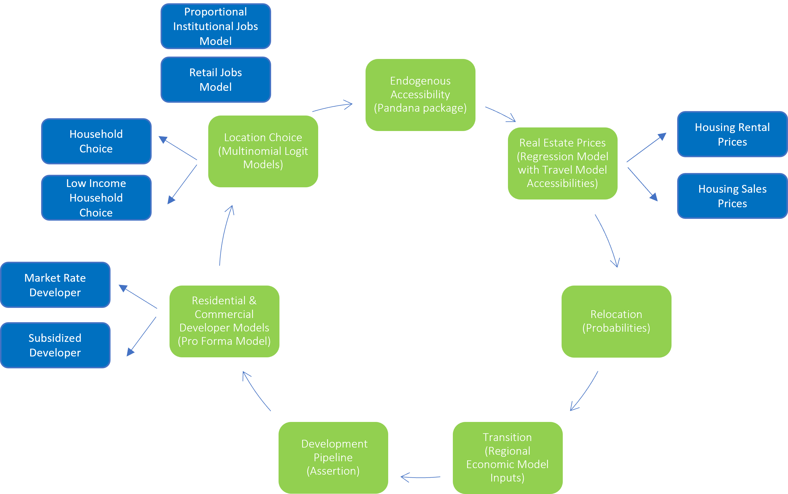

# Bay Area UrbanSim (BAUS)

## Model Overview

Bay Area UrbanSim (BAUS) is a microsimulation land use model used to forecast intraregional growth, study urban policies, and evaluate transportation projects at the Metropolitan Transportation Commission (MTC). UrbanSim simulates the movement of households and firms within the region and the construction of new buildings to hold those households and firms. In this manner, it is used to incrementally forecast potential future urban growth trajectories. 

### BAUS Sub-Model Flow

A series of sub-models gener* Earthquake: Simulates the impact of an earthquake by destroying buildings based on their characteristics, displacing their inhabitants, and leaving them open to redevelopment.

* Accessibility: Pandana is used in the model to calculate endogenous accessibility variables. These generally describe how close a parcel is to something (e.g., BART) or how many things are nearby a parcel (e.g., jobs), in turn influencing price models and location choice models. Both local (local street network from Open Street Map) and regional (travel model network) networks are used to compute these variables.

* Housing Prices & Rents: Hedonic regression models are applied to current model year conditions to estimate prices and rents in that year. Accessibillity informationfrom the Travel Model and is entered into these models, allowing future year travel conditions to influence real estate prices. This is central to MTC's integrated land use and travel modeling.

* Household & Firm Relocation: Households and employeees are selected to move based on relocation probabilities. Household move-out choice is conditional on tenure status. Households and firms that are selected to relocate are added to the set of relocation agents looking for homes and job space. 

* Household & Firm Transition: Regional economic and demographic information is supplied to BAUS from the REMI CGE model and related demographic processing scripts. BAUS outputs on housing production are used to adjust regional housing prices (and thus other variables) in REMI. Additional households and employees are added or subtracted from BAUS in each model time step to reflect the exogenous control totals. Any net additional households and firms are added to the set of relocation agents looking for homes and job space. 

* Development Pipeline Projects: Buildings in the region's development pipeline are constructed by entering the projects into the development poipeline list. These are often large approved development projects and development that has occurred after the model's base year. 

* Market-rate Developer: The for-profit real estate development model in BAUS samples locations in the region in order to assess to evaluate potential development sites using a simplified pro forma model.

* ADU Model: A zone-level model asserts ADU development to reflect ADU policy.

* Ground floor retail model: A ground floor retail model adds retail to multi-story buildings to reflect typical policy.

* Affordable Housing Developer: In many simulations, a similar not-for-profit real estate development process produces affordable housing units based on money available within BAUS affordable housing funding accounts.

* Household & Firm Location Choice: Households and firms are assigned to new locations based on logistic regresssion models that capture the preferences of particular segments of households and jobs (e.g., lower income households, retail jobs). Household location choice models are also run that allow low-income households to have priority for selecting affordable housing units. 

* Proportional Jobs Model: Particular industry sectors which don't follow traditional market economics are forecast separately from. For government and education jobs, the number of jobs grow over the simulation period in proportion to their zonal shares. The buildings that house these jobs are off-limits from redevelopment.

* Retail Model: An additional retail model takes into account where demand for retail is high and supply is low to ensure there are retail services in each jurisdiction. Retail demand is a function of the number of households and household incomes.